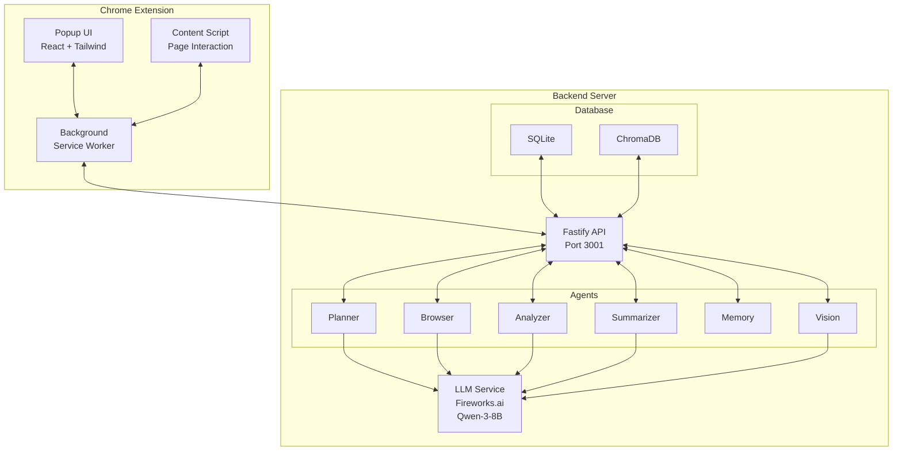
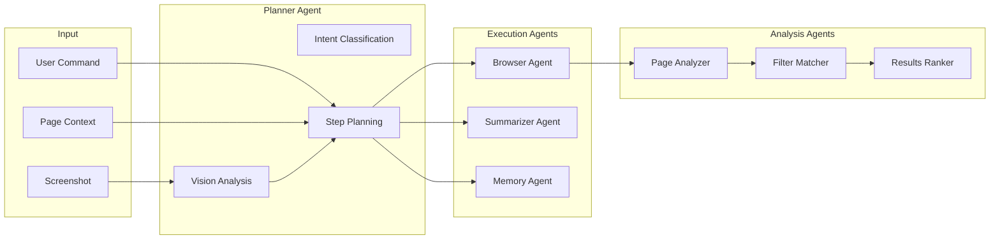

# ASTRA – Multi-Agent Browser Automation Assistant

<p align="center">
  
</p>

<p align="center">
  <a href="https://chromewebstore.google.com"></a>
  <a href="https://www.typescript.org"></a>
  <a href="https://fastify.dev"></a>
  <a href="https://react.dev"></a>
  <a href="https://fireworks.ai"></a>
</p>

---

## 📋 Table of Contents

1. [Overview](#overview)
2. [Architecture](#architecture)
3. [Features](#features)
4. [Quick Start](#quick-start)
5. [Installation](#installation)
6. [Configuration](#configuration)
7. [Usage Guide](#usage-guide)
8. [API Reference](#api-reference)
9. [Agent System](#agent-system)
10. [Development](#development)
11. [Troubleshooting](#troubleshooting)

---

## 🔭 Overview

**ASTRA** is an intelligent multi-agent browser automation assistant that combines the power of large language models with browser automation to help you research, analyze, and interact with web content more efficiently.

### What ASTRA Does

ASTRA understands natural language commands and breaks them down into executable steps:

```
User: "Find top AI courses on Udemy under 10 hours"
         │
         ▼
    ┌─────────────┐
    │   PLANNER   │ ← Intent recognition & step planning
    │   AGENT     │
    └─────────────┘
         │
         ▼
    ┌─────────────┐
    │   BROWSER   │ ← Execute browser actions
    │   AGENT     │
    └─────────────┘
         │
         ▼
    ┌─────────────┐
    │  ANALYZER   │ ← Rank & summarize results
    │   AGENT     │
    └─────────────┘
         │
         ▼
    ┌─────────────┐
    │    USER     │ ← Rich results with ratings, links
    └─────────────┘
```

---

## 🏗️ Architecture

### System Overview



### Project Structure

```
ASTRA-Xtension/
├── backend/                    # Node.js backend server
│   ├── src/
│   │   ├── server.ts          # Fastify server entry point
│   │   ├── agents/            # Multi-agent system
│   │   │   ├── planner.ts     # Intent recognition & planning
│   │   │   ├── browser.ts     # Browser action execution
│   │   │   ├── analyzer.ts    # Page analysis & ranking
│   │   │   ├── summarizer.ts  # Content summarization
│   │   │   ├── memory.ts      # Persistent memory storage
│   │   │   └── vision.ts      # Screenshot vision analysis
│   │   ├── routes/            # API endpoints
│   │   │   ├── intent.ts      # POST /intent - Plan commands
│   │   │   ├── execute.ts    # POST /execute - Run plans
│   │   │   ├── analyze.ts     # POST /analyze - Analyze pages
│   │   │   ├── summarize.ts   # POST /summarize - Summarize text
│   │   │   └── memory.ts       # Memory operations
│   │   ├── services/
│   │   │   └── llm.ts         # Fireworks.ai Qwen integration
│   │   ├── db/
│   │   │   ├── sqlite.ts      # SQLite (commands, memories)
│   │   │   └── chroma.ts     # ChromaDB (semantic search)
│   │   └── types/
│   │       └── index.ts       # TypeScript definitions
│   └── package.json
│
├── extension/                  # Chrome extension
│   ├── src/
│   │   ├── popup/
│   │   │   ├── Popup.tsx      # Main popup UI
│   │   │   ├── index.tsx     # React entry
│   │   │   └── index.css     # Tailwind styles
│   │   ├── background/
│   │   │   └── index.ts      # Service worker
│   │   ├── content/
│   │   │   └── index.ts      # Page content script
│   │   └── types/
│   │       └── messages.ts   # Message types
│   ├── public/
│   │   ├── manifest.json     # Manifest V3
│   │   └── icons/           # Extension icons
│   └── package.json
│
└── package.json              # Workspace root
```

---

## ✨ Features

### Core Capabilities

| Feature | Description |
|---------|-------------|
| **Natural Language Commands** | Type commands in plain English |
| **Smart Intent Planning** | AI-powered step decomposition |
| **In-Page Search** | Uses website's own search (no redirect to Google) |
| **Result Ranking** | Ranks by relevance + popularity |
| **Page Analysis** | Scrolls & extracts full page content |
| **Screenshot Vision** | Analyzes restricted pages via screenshots |
| **Persistent Memory** | Stores and retrieves information |
| **Multi-Format Output** | Summaries, bullet points, ranked lists |

### Supported Actions

```javascript
// Browser Actions
open_tab, close_tab, switch_tab
scroll, click, type, wait
search, read_page, analyze_page

// Summarizer Actions  
summarize, bullets

// Memory Actions
store, retrieve
```

### Command Examples

```plaintext
"Find top rated Python courses on Udemy"
"Summarize this page"
"Search Reddit for AI news posts"
"What are the best books on machine learning?"
"Find products under $50 on Amazon"
"Collect posts from r/technology about AI"
```

---

## 🚀 Quick Start

### Prerequisites

- **Node.js** 18+ 
- **npm** 9+
- **Chrome/Edge** browser
- **Fireworks.ai** API key (free tier available)

### 5-Minute Setup

```bash
# 1. Clone the repository
cd ASTRA-Xtension

# 2. Install dependencies
npm install

# 3. Configure environment
cp backend/.env.example backend/.env
# Edit .env and add your FIREWORKS_API_KEY

# 4. Start the backend
npm run dev:backend

# 5. Build & load the extension
npm run build:ext
# Open chrome://extensions → Enable Developer Mode
# → Load Unpacked → Select extension/dist
```

---

## 📦 Installation

### Backend Setup

```bash
# Navigate to backend directory
cd backend

# Install dependencies
npm install

# Create environment file
cp .env.example .env
```

### Environment Variables

```env
# Required: Fireworks.ai API
QWEN_API_URL=https://api.fireworks.ai/inference/v1/chat/completions
QWEN_API_KEY=your_api_key_here
QWEN_MODEL=accounts/fireworks/models/qwen3-8b

# Server Configuration
PORT=3001
HOST=0.0.0.0

# Optional: ChromaDB for semantic search
CHROMA_URL=http://localhost:8000

# Optional: Vision model for screenshots
VISION_MODEL=accounts/fireworks/models/qwen3-vl-30b-a3b-instruct
```

### Get Fireworks.ai API Key

1. Visit [fireworks.ai](https://fireworks.ai)
2. Create an account (free tier available)
3. Navigate to API Keys
4. Create a new key
5. Add to your `.env` file

### Extension Setup

```bash
# Build the extension
npm run build:ext

# The built extension is in: extension/dist
```

### Load in Chrome

1. Open `chrome://extensions`
2. Enable **Developer mode** (top right)
3. Click **Load unpacked**
4. Select the `extension/dist` folder

---

## ⚙️ Configuration

### Backend Configuration

| Variable | Default | Description |
|----------|---------|-------------|
| `PORT` | 3001 | Server port |
| `HOST` | 0.0.0.0 | Server host |
| `QWEN_API_KEY` | (required) | Fireworks.ai API key |
| `QWEN_MODEL` | qwen3-8b | LLM model to use |
| `CHROMA_URL` | localhost:8000 | ChromaDB server URL |
| `VISION_MODEL` | qwen3-vl-30b | Vision model for screenshots |

### Extension Configuration

The extension is pre-configured with sensible defaults. Key settings in `manifest.json`:

```json
{
  "permissions": [
    "activeTab",
    "tabs", 
    "scripting",
    "storage"
  ],
  "host_permissions": [
    "<all_urls>"
  ]
}
```

---

## 📖 Usage Guide

### Using the Extension Popup

1. **Click the ASTRA icon** in your Chrome toolbar
2. **Type a command** in the input field
3. **Press Enter** or click **Run**
4. **View results** in the output panel

### Example Workflows

#### Research a Topic

```
User: "Find top posts about AI agents on Reddit"

ASTRA:
1. Opens Reddit search
2. Types "AI agents"
3. Waits for results
4. Scrolls through results
5. Ranks by upvotes & relevance
6. Returns top 8 with summaries
```

#### Summarize Content

```
User: "Summarize this page"

ASTRA:
1. Scrolls through the page
2. Extracts all content
3. Generates concise summary
4. Returns key points
```

#### Compare Products

```
User: "Find best wireless headphones under $100 on Amazon"

ASTRA:
1. Opens Amazon
2. Searches "wireless headphones"
3. Applies price filter
4. Ranks by rating & reviews
5. Returns top picks with prices
```

---

## 📡 API Reference

### Base URL

```
http://localhost:3001
```

### Endpoints

#### 1. Health Check

```http
GET /health
```

**Response:**
```json
{
  "status": "ok",
  "service": "astra-backend",
  "version": "0.1.0",
  "timestamp": "2025-01-15T10:30:00.000Z"
}
```

---

#### 2. Intent Planning

```http
POST /intent
```

**Request:**
```json
{
  "prompt": "Find top AI courses on Udemy",
  "context": {
    "url": "https://www.udemy.com",
    "title": "Udemy"
  },
  "screenshot": "data:image/png;base64,..."
}
```

**Response:**
```json
{
  "plan": {
    "intent": "Search Udemy for AI courses and rank by rating",
    "category": "research",
    "steps": [
      {
        "id": "1",
        "agent": "browser",
        "action": "search",
        "params": { "value": "AI machine learning courses" }
      },
      {
        "id": "2", 
        "agent": "browser",
        "action": "wait",
        "params": { "duration": 2500 }
      },
      {
        "id": "3",
        "agent": "browser", 
        "action": "analyze_page",
        "params": { "maxScrolls": 8, "scrollDelay": 300 }
      }
    ],
    "reasoning": "Full research pipeline: search → wait → analyze results"
  }
}
```

---

#### 3. Execute Plan

```http
POST /execute
```

**Request:**
```json
{
  "plan": {
    "steps": [...]
  },
  "prompt": "Find top AI courses"
}
```

**Response:**
```json
{
  "success": true,
  "data": { ... },
  "summary": "Successfully executed 3 steps",
  "steps": [
    { "stepId": "1", "success": true, "durationMs": 1500 },
    { "stepId": "2", "success": true, "durationMs": 2600 },
    { "stepId": "3", "success": true, "durationMs": 3200 }
  ]
}
```

---

#### 4. Analyze Page

```http
POST /analyze
```

**Request:**
```json
{
  "prompt": "What are the top 5 results?",
  "pageData": {
    "title": "Search Results",
    "url": "https://...",
    "fullText": "...",
    "sections": [...],
    "links": [...]
  }
}
```

**Response:**
```json
{
  "success": true,
  "summary": "## 🎯 ASTRA's Top Picks\n\n1. **Course Title** - 4.8 stars\n   ...",
  "rankedResults": [
    {
      "rank": 1,
      "title": "Course Title",
      "rating": "4.8 stars",
      "reviewCount": "12,400 reviews",
      "badge": "🏆 Best Match"
    }
  ],
  "data": {
    "pageTitle": "Search Results",
    "contentLength": 15000,
    "sectionsFound": 10,
    "linksFound": 45
  }
}
```

---

#### 5. Memory Operations

```http
# Store
POST /memory/store
{
  "text": "User prefers dark mode",
  "metadata": { "category": "preference" }
}

# Retrieve
POST /memory/retrieve
{
  "query": "user preferences",
  "topK": 5
}
```

---

## 🤖 Agent System

### Agent Architecture



### Agent Details

#### Planner Agent
- **Purpose**: Understand user intent and create execution plans
- **Model**: Qwen-3-8B
- **Features**:
  - Intent classification (browse, research, summarize, memory, composite)
  - Multi-step planning with dependencies
  - Vision-informed planning for complex queries
  - Smart constraint extraction (ratings, price, duration)

#### Browser Agent
- **Purpose**: Execute browser automation actions
- **Actions**: search, click, wait, analyze, type, scroll_page
- **Features**:
  - In-page search (no redirect)
  - Automatic scroll & extraction
  - Form filling support

#### Analyzer Agent
- **Purpose**: Analyze page content and rank results
- **Features**:
  - Page content summarization
  - Search result ranking by relevance + popularity
  - Smart filter matching
  - Table and structured data extraction

#### Summarizer Agent
- **Purpose**: Generate concise summaries
- **Actions**: summarize, bullets
- **Features**:
  - Configurable length
  - Bullet point generation
  - Key fact preservation

#### Memory Agent
- **Purpose**: Persistent information storage
- **Actions**: store, retrieve
- **Storage**:
  - SQLite (structured data)
  - ChromaDB (semantic search)

#### Vision Agent
- **Purpose**: Analyze screenshots for restricted pages
- **Features**:
  - Screen type detection
  - UI element identification
  - Search input detection
  - Action suggestion

---

## 🔧 Development

### Available Scripts

```bash
# Root workspace
npm run dev:ext        # Development mode for extension
npm run dev:backend    # Development mode for backend
npm run build:ext      # Build extension for production
npm run build:backend  # Build backend for production

# Backend specific
cd backend
npm run dev           # Watch mode with tsx
npm run build         # Compile TypeScript
npm run start         # Run compiled server
npm run lint          # Type check

# Extension specific
cd extension
npm run dev           # Vite dev server
npm run build         # Build with Vite
npm run type-check    # TypeScript check
```

### Development Workflow

```bash
# Terminal 1: Backend
npm run dev:backend

# Terminal 2: Extension (optional for popup dev)
cd extension && npm run dev
```

### Database

- **SQLite**: Local file at `backend/astra.db`
  - Tables: users, sessions, commands, memories
- **ChromaDB**: Optional, for semantic memory search
  - Default: `http://localhost:8000`

---

## 🐛 Troubleshooting

### Common Issues

#### API Key Not Working
```
Error: Fireworks API 401: Invalid API key
```
**Fix**: Verify your API key in `backend/.env`

#### Extension Not Loading
```
Could not load manifest.json
```
**Fix**: Build the extension first with `npm run build:ext`

#### Backend Connection Failed
```
Error: connect ECONNREFUSED 127.0.0.1:3001
```
**Fix**: Start backend with `npm run dev:backend`

#### CORS Errors
```
Access to fetch blocked by CORS policy
```
**Fix**: Ensure backend is running and extension is pointing to correct port

#### Page Analysis Timeout
```
Error: Analysis exceeded timeout
```
**Fix**: Reduce `maxScrolls` parameter or improve page load speed

### Debug Mode

Enable verbose logging in `backend/src/server.ts`:

```typescript
const app = Fastify({
    logger: {
        level: 'debug',  // Change from 'info' to 'debug'
        // ...
    }
});
```

### Logs

- **Backend**: Console output with pino-pretty formatting
- **Extension**: Chrome DevTools → Background script

---

## 📄 License

MIT License - See LICENSE file for details

---

## 🙏 Acknowledgments

- [Fireworks.ai](https://fireworks.ai) - LLM infrastructure
- [Qwen](https://qwen.ai) - Language models
- [Fastify](https://fastify.dev) - Web framework
- [Chroma](https://chromadb.ai) - Vector database

---

<div align="center">

**ASTRA** — Your AI Browser Assistant

*Built with ❤️ using Qwen + React + TypeScript*

</div>
