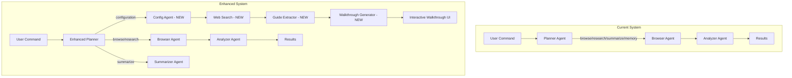

# ASTRA Configuration Assistant - Implementation Plan

## 📋 Executive Summary

This document outlines the implementation plan for extending ASTRA's capabilities to handle configuration-related tasks. The enhanced system will understand user intent for configuration queries, search the web in real-time for relevant guides, and provide interactive step-by-step walkthroughs.

---

## 🎯 Goals & Objectives

### Primary Goals
1. **Intent Recognition**: Detect when users need configuration help vs. search/research
2. **Real-time Knowledge Retrieval**: Search the web for up-to-date configuration guides
3. **Interactive Guidance**: Provide step-by-step walkthroughs with navigation controls
4. **Generic Application Support**: Work with any application's configuration needs

### Success Criteria
- Users can ask "How do I configure X in Y?" and receive actionable guidance
- Step-by-step walkthroughs are easy to follow with clear navigation
- System correctly distinguishes configuration queries from search queries
- Response time remains under 10 seconds for guide retrieval

---

## 🏗️ Architecture Overview

### Current vs. Proposed Architecture



### New Components

| Component | Purpose | Location |
|-----------|---------|----------|
| **Config Agent** | Handle configuration intent detection and orchestration | `backend/src/agents/config.ts` |
| **Web Search Service** | Search the web for configuration guides | `backend/src/services/webSearch.ts` |
| **Guide Extractor** | Extract and parse guide content from web pages | `backend/src/agents/guideExtractor.ts` |
| **Walkthrough Generator** | Convert guides to step-by-step format | `backend/src/agents/walkthroughGenerator.ts` |
| **Walkthrough UI** | Interactive step-by-step display | `extension/src/popup/Walkthrough.tsx` |

---

## 📦 Detailed Component Design

### 1. Enhanced Planner Agent

**File**: [`backend/src/agents/planner.ts`](backend/src/agents/planner.ts)

#### Changes Required

1. **New Intent Category**: Add `configuration` to existing categories
   ```typescript
   // Current categories
   type Category = 'browse' | 'research' | 'summarize' | 'memory' | 'composite';
   
   // Enhanced categories
   type Category = 'browse' | 'research' | 'summarize' | 'memory' | 'configuration' | 'composite';
   ```

2. **Intent Detection Patterns**: Add configuration-specific patterns
   ```typescript
   const CONFIG_PATTERNS = [
     /how (do i|to) (configure|setup|set up|change|update|modify)/i,
     /where (is|are) (the |my )?(settings?|configuration|options)/i,
     /help me (configure|setup|find|change)/i,
     /(enable|disable|turn on|turn off) .*(setting|option|feature)/i,
     /(privacy|security|account) settings?/i,
     /configure .*(oic|ofsc|oci|oracle)/i,
     /i (want to|need to) (change|update|configure)/i,
   ];
   ```

3. **New Agent Step Type**: Add `config` agent
   ```typescript
   export interface AgentStep {
       id: string;
       agent: 'browser' | 'summarizer' | 'memory' | 'config'; // NEW
       action: string;
       params: Record<string, unknown>;
       dependsOn?: string;
   }
   ```

### 2. Configuration Agent

**File**: `backend/src/agents/config.ts` (NEW)

```typescript
// Pseudocode structure
export interface ConfigRequest {
  query: string;           // User's configuration question
  application?: string;    // Detected application (e.g., "Facebook", "OIC")
  context?: {
    currentUrl?: string;   // User's current page
    pageTitle?: string;
  };
}

export interface ConfigResponse {
  intent: string;          // What user wants to configure
  application: string;     // Detected application
  searchQuery: string;     // Query used for web search
  guides: GuideResult[];   // Found guides
  walkthrough: Walkthrough; // Generated step-by-step guide
}

export interface Walkthrough {
  id: string;
  title: string;
  description: string;
  application: string;
  totalSteps: number;
  steps: WalkthroughStep[];
  source: string;          // Original guide URL
  lastUpdated: string;
}

export interface WalkthroughStep {
  stepNumber: number;
  title: string;
  instruction: string;
  tips?: string[];
  warnings?: string[];
  screenshot?: string;     // Optional screenshot URL
  action?: {               // Optional action ASTRA can help with
    type: 'navigate' | 'click' | 'input';
    description: string;
    target?: string;
  };
}
```

#### Main Functions

```typescript
// Main orchestration function
export async function handleConfigRequest(request: ConfigRequest): Promise<ConfigResponse>

// Detect application from query and context
function detectApplication(query: string, context?: ConfigContext): string

// Generate optimized search query
function buildSearchQuery(query: string, application: string): string

// Rank and filter guides by relevance
function rankGuides(guides: GuideResult[], query: string): GuideResult[]
```

### 3. Web Search Service

**File**: `backend/src/services/webSearch.ts` (NEW)

#### Options for Implementation

| Option | Pros | Cons |
|--------|------|------|
| **DuckDuckGo API** | Free, no API key needed | Limited results |
| **SerpAPI** | High quality, Google results | Paid service |
| **Bing Search API** | Good free tier | Requires API key |
| **Custom Web Scraper** | Full control | Maintenance burden |

**Recommended**: Start with DuckDuckGo for MVP, add SerpAPI as premium option

#### Detailed Implementation

```typescript
// backend/src/services/webSearch.ts

import { chat } from './llm.js';

// ─── Types ───

export interface WebSearchResult {
  title: string;
  url: string;
  snippet: string;
  source: string;        // Domain name
  relevanceScore?: number;
  publishedDate?: string;
  thumbnail?: string;
}

export interface WebSearchOptions {
  maxResults?: number;       // Default: 10
  excludeDomains?: string[]; // Domains to skip
  includeDomains?: string[]; // Only search these domains
  region?: string;           // Region code for localized results
  safeSearch?: boolean;      // Enable safe search
  timeRange?: 'day' | 'week' | 'month' | 'year'; // Time filter
}

export interface FetchPageOptions {
  timeout?: number;          // Default: 10000ms
  maxContentLength?: number; // Default: 50000 chars
  followRedirects?: boolean; // Default: true
  userAgent?: string;
}

// ─── Main Search Function ───

/**
 * Search the web using DuckDuckGo Instant Answer API
 * Falls back to HTML scraping if instant answer is unavailable
 */
export async function searchWeb(
  query: string,
  options: WebSearchOptions = {}
): Promise<WebSearchResult[]> {
  const {
    maxResults = 10,
    excludeDomains = [],
    includeDomains = [],
    region = 'us-en',
    safeSearch = true,
    timeRange
  } = options;

  // Build search query with domain filters
  let searchQuery = query;
  
  if (includeDomains.length > 0) {
    searchQuery += ' ' + includeDomains.map(d => `site:${d}`).join(' OR ');
  }
  
  if (excludeDomains.length > 0) {
    searchQuery += ' ' + excludeDomains.map(d => `-site:${d}`).join(' ');
  }

  try {
    // Method 1: DuckDuckGo Instant Answer API (free, no key)
    const instantResults = await searchDuckDuckGoInstant(searchQuery, maxResults);
    
    if (instantResults.length > 0) {
      return rankResults(instantResults, query);
    }

    // Method 2: DuckDuckGo HTML scraping (fallback)
    const scrapedResults = await searchDuckDuckGoHTML(searchQuery, maxResults, region);
    return rankResults(scrapedResults, query);

  } catch (error) {
    console.error('[WebSearch] Search failed:', error);
    throw new Error(`Web search failed: ${(error as Error).message}`);
  }
}

// ─── DuckDuckGo Instant Answer API ───

async function searchDuckDuckGoInstant(
  query: string,
  maxResults: number
): Promise<WebSearchResult[]> {
  const url = new URL('https://api.duckduckgo.com/');
  url.searchParams.set('q', query);
  url.searchParams.set('format', 'json');
  url.searchParams.set('no_html', '1');
  url.searchParams.set('skip_disambig', '1');

  const response = await fetch(url.toString(), {
    headers: {
      'Accept': 'application/json',
    }
  });

  if (!response.ok) {
    throw new Error(`DuckDuckGo API error: ${response.status}`);
  }

  const data = await response.json();
  const results: WebSearchResult[] = [];

  // Extract related topics
  if (data.RelatedTopics && Array.isArray(data.RelatedTopics)) {
    for (const topic of data.RelatedTopics.slice(0, maxResults)) {
      if (topic.FirstURL && topic.Text) {
        results.push({
          title: extractTitleFromText(topic.Text),
          url: topic.FirstURL,
          snippet: topic.Text,
          source: extractDomain(topic.FirstURL),
        });
      }
    }
  }

  // Extract abstract if available
  if (data.Abstract && data.AbstractURL) {
    results.unshift({
      title: data.Heading || 'Summary',
      url: data.AbstractURL,
      snippet: data.Abstract,
      source: extractDomain(data.AbstractURL),
    });
  }

  return results;
}

// ─── DuckDuckGo HTML Scraping (Fallback) ───

async function searchDuckDuckGoHTML(
  query: string,
  maxResults: number,
  region: string
): Promise<WebSearchResult[]> {
  const url = new URL('https://html.duckduckgo.com/html/');
  url.searchParams.set('q', query);
  url.searchParams.set('kl', region);

  const response = await fetch(url.toString(), {
    headers: {
      'User-Agent': 'Mozilla/5.0 (Windows NT 10.0; Win64; x64) AppleWebKit/537.36',
      'Accept': 'text/html',
    }
  });

  if (!response.ok) {
    throw new Error(`DuckDuckGo HTML error: ${response.status}`);
  }

  const html = await response.text();
  return parseDDGHTML(html, maxResults);
}

function parseDDGHTML(html: string, maxResults: number): WebSearchResult[] {
  const results: WebSearchResult[] = [];
  
  // Regex patterns for DuckDuckGo HTML
  const resultPattern = /<a[^>]*class="result__a"[^>]*href="([^"]*)"[^>]*>([^<]*)<\/a>/g;
  const snippetPattern = /<a[^>]*class="result__snippet"[^>]*>([^<]*)<\/a>/g;

  let match;
  let count = 0;

  while ((match = resultPattern.exec(html)) !== null && count < maxResults) {
    const url = match[1];
    const title = match[2].trim();
    
    // DuckDuckGo uses redirect URLs, extract actual URL
    const actualUrl = extractRedirectUrl(url);
    
    results.push({
      title,
      url: actualUrl,
      snippet: '', // Will be filled by snippet pattern
      source: extractDomain(actualUrl),
    });
    count++;
  }

  return results;
}

// ─── Page Content Fetching ───

/**
 * Fetch and extract text content from a web page
 */
export async function fetchPageContent(
  url: string,
  options: FetchPageOptions = {}
): Promise<string> {
  const {
    timeout = 10000,
    maxContentLength = 50000,
    followRedirects = true,
    userAgent = 'Mozilla/5.0 (compatible; ASTRA-Bot/1.0)'
  } = options;

  const controller = new AbortController();
  const timeoutId = setTimeout(() => controller.abort(), timeout);

  try {
    const response = await fetch(url, {
      signal: controller.signal,
      headers: {
        'User-Agent': userAgent,
        'Accept': 'text/html,application/xhtml+xml',
        'Accept-Language': 'en-US,en;q=0.9',
      },
      redirect: followRedirects ? 'follow' : 'manual',
    });

    clearTimeout(timeoutId);

    if (!response.ok) {
      throw new Error(`HTTP ${response.status}: ${response.statusText}`);
    }

    const contentType = response.headers.get('content-type') || '';
    
    if (!contentType.includes('text/html')) {
      throw new Error(`Unsupported content type: ${contentType}`);
    }

    const html = await response.text();
    
    if (html.length > maxContentLength) {
      console.warn(`[WebSearch] Content truncated from ${html.length} to ${maxContentLength}`);
    }

    return extractTextFromHTML(html.slice(0, maxContentLength));

  } catch (error) {
    clearTimeout(timeoutId);
    
    if ((error as Error).name === 'AbortError') {
      throw new Error(`Request timeout after ${timeout}ms`);
    }
    
    throw error;
  }
}

/**
 * Extract readable text from HTML content
 */
function extractTextFromHTML(html: string): string {
  // Remove scripts, styles, and other non-content elements
  let text = html
    .replace(/<script[^>]*>[\s\S]*?<\/script>/gi, '')
    .replace(/<style[^>]*>[\s\S]*?<\/style>/gi, '')
    .replace(/<nav[^>]*>[\s\S]*?<\/nav>/gi, '')
    .replace(/<footer[^>]*>[\s\S]*?<\/footer>/gi, '')
    .replace(/<header[^>]*>[\s\S]*?<\/header>/gi, '')
    .replace(/<aside[^>]*>[\s\S]*?<\/aside>/gi, '')
    .replace(/<!--[\s\S]*?-->/g, '')
    .replace(/<[^>]+>/g, ' ')  // Remove remaining tags
    .replace(/\s+/g, ' ')       // Normalize whitespace
    .replace(/&nbsp;/g, ' ')
    .replace(/&amp;/g, '&')
    .replace(/&lt;/g, '<')
    .replace(/&gt;/g, '>')
    .replace(/&quot;/g, '"')
    .trim();

  return text;
}

// ─── Result Ranking ───

/**
 * Rank search results by relevance to the query
 */
async function rankResults(
  results: WebSearchResult[],
  query: string
): Promise<WebSearchResult[]> {
  if (results.length === 0) return results;

  // Use LLM to score relevance (optional, can be skipped for speed)
  // For MVP, use simple keyword matching
  
  const queryTerms = query.toLowerCase().split(/\s+/);
  
  const scored = results.map(result => {
    let score = 0;
    const titleLower = result.title.toLowerCase();
    const snippetLower = result.snippet.toLowerCase();
    
    for (const term of queryTerms) {
      if (titleLower.includes(term)) score += 3;
      if (snippetLower.includes(term)) score += 1;
    }
    
    // Boost official documentation sites
    if (isOfficialSource(result.source)) {
      score += 2;
    }
    
    return { ...result, relevanceScore: score };
  });

  return scored.sort((a, b) => (b.relevanceScore || 0) - (a.relevanceScore || 0));
}

// ─── Helper Functions ───

function extractDomain(url: string): string {
  try {
    const parsed = new URL(url);
    return parsed.hostname.replace('www.', '');
  } catch {
    return 'unknown';
  }
}

function extractTitleFromText(text: string): string {
  // DuckDuckGo returns "Title - Description" format
  const parts = text.split(' - ');
  return parts[0] || text.slice(0, 100);
}

function extractRedirectUrl(redirectUrl: string): string {
  // DuckDuckGo uses URLs like: //duckduckgo.com/l/?uddg=ENCODED_URL
  try {
    const url = new URL(redirectUrl, 'https://duckduckgo.com');
    const uddg = url.searchParams.get('uddg');
    return uddg ? decodeURIComponent(uddg) : redirectUrl;
  } catch {
    return redirectUrl;
  }
}

function isOfficialSource(domain: string): boolean {
  const officialPatterns = [
    /\.oracle\.com$/i,
    /\.facebook\.com$/i,
    /\.meta\.com$/i,
    /\.google\.com$/i,
    /\.microsoft\.com$/i,
    /\.apple\.com$/i,
    /support\./i,
    /docs\./i,
    /help\./i,
    /documentation\./i,
  ];

  return officialPatterns.some(pattern => pattern.test(domain));
}

// ─── Export All ───

export default {
  searchWeb,
  fetchPageContent,
};
```

#### Environment Configuration

Add to `backend/.env.example`:

```env
# Web Search Configuration (Optional)
WEB_SEARCH_TIMEOUT=10000
WEB_SEARCH_MAX_RESULTS=10
WEB_SEARCH_MAX_CONTENT=50000

# Premium Search (Optional - for production)
SERPAPI_KEY=your_serpapi_key_here
BING_SEARCH_KEY=your_bing_key_here
```

#### Error Handling Strategy

```typescript
// Error types for web search
export class WebSearchError extends Error {
  constructor(
    message: string,
    public code: 'TIMEOUT' | 'NETWORK' | 'PARSE' | 'RATE_LIMIT' | 'UNKNOWN',
    public originalError?: Error
  ) {
    super(message);
    this.name = 'WebSearchError';
  }
}

// Retry logic for transient failures
async function withRetry<T>(
  fn: () => Promise<T>,
  maxRetries: number = 2,
  delayMs: number = 1000
): Promise<T> {
  let lastError: Error | undefined;
  
  for (let attempt = 0; attempt <= maxRetries; attempt++) {
    try {
      return await fn();
    } catch (error) {
      lastError = error as Error;
      
      if (attempt < maxRetries) {
        await new Promise(resolve => setTimeout(resolve, delayMs * (attempt + 1)));
      }
    }
  }
  
  throw lastError;
}
```

#### Usage Example

```typescript
// In config agent
import { searchWeb, fetchPageContent } from '../services/webSearch.js';

async function findConfigurationGuides(query: string, application: string) {
  // Step 1: Search for guides
  const searchQuery = `${application} configuration ${query} guide tutorial`;
  
  const results = await searchWeb(searchQuery, {
    maxResults: 5,
    includeDomains: getTrustedDomains(application),
    timeRange: 'year', // Prefer recent guides
  });

  // Step 2: Fetch content from top results
  const guides = await Promise.all(
    results.slice(0, 3).map(async (result) => {
      try {
        const content = await fetchPageContent(result.url);
        return {
          ...result,
          content,
        };
      } catch (error) {
        console.warn(`Failed to fetch ${result.url}:`, error);
        return null;
      }
    })
  );

  return guides.filter(Boolean);
}

function getTrustedDomains(application: string): string[] {
  const domainMap: Record<string, string[]> = {
    'facebook': ['facebook.com', 'meta.com', 'help.instagram.com'],
    'oracle': ['oracle.com', 'docs.oracle.com'],
    'oci': ['docs.oracle.com', 'oracle.com'],
    'oic': ['docs.oracle.com', 'oracle.com'],
    'ofsc': ['docs.oracle.com', 'oracle.com'],
  };
  
  return domainMap[application.toLowerCase()] || [];
}
```

### 4. Guide Extractor Agent

**File**: `backend/src/agents/guideExtractor.ts` (NEW)

This agent uses the LLM to extract structured guide content from web pages. It's responsible for parsing raw HTML content, identifying configuration steps, and structuring them into a format suitable for walkthrough generation.

#### Detailed Implementation

```typescript
// backend/src/agents/guideExtractor.ts

import { chat, chatJSON } from '../services/llm.js';
import { fetchPageContent, type WebSearchResult } from '../services/webSearch.js';

// ─── Types ───

export interface ExtractedStep {
  order: number;
  title: string;
  instruction: string;
  tips?: string[];
  warnings?: string[];
  prerequisites?: string[];
  uiElements?: UIElement[];  // Buttons, menus, inputs mentioned
  navigation?: NavigationHint;
}

export interface UIElement {
  type: 'button' | 'menu' | 'input' | 'link' | 'tab' | 'dropdown' | 'checkbox' | 'toggle';
  label: string;              // Text on the element
  location?: string;          // Where it's located (e.g., "top right corner")
  action?: string;            // What to do with it (click, type, select)
}

export interface NavigationHint {
  path: string[];             // Menu path like ["Settings", "Privacy", "Security"]
  url?: string;               // Direct URL if mentioned
  shortcut?: string;          // Keyboard shortcut if mentioned
}

export interface ExtractedGuide {
  id: string;
  title: string;
  source: {
    url: string;
    name: string;             // Domain or site name
    credibility: 'official' | 'community' | 'blog' | 'unknown';
  };
  application: string;
  summary: string;            // Brief overview of what this guide covers
  steps: ExtractedStep[];
  prerequisites?: string[];
  requirements?: string[];    // Account type, permissions, etc.
  relatedTopics?: string[];
  difficulty?: 'beginner' | 'intermediate' | 'advanced';
  estimatedTime?: string;
  lastVerified?: string;
}

export interface ExtractionOptions {
  maxSteps?: number;          // Maximum steps to extract (default: 15)
  includeImages?: boolean;    // Whether to extract image URLs
  language?: string;          // Expected language of content
  focusArea?: string;         // Specific aspect to focus on
}

export interface ExtractionResult {
  success: boolean;
  guide?: ExtractedGuide;
  error?: string;
  confidence: number;         // 0-1 confidence score
  alternativeGuides?: ExtractedGuide[];
}

// ─── Main Extraction Function ───

/**
 * Extract a structured guide from web page content
 */
export async function extractGuideFromContent(
  content: string,
  url: string,
  userQuery: string,
  options: ExtractionOptions = {}
): Promise<ExtractionResult> {
  const {
    maxSteps = 15,
    includeImages = false,
    focusArea
  } = options;

  // Step 1: Pre-process content
  const processedContent = preprocessContent(content, maxSteps);

  // Step 2: Extract guide using LLM
  const extractionPrompt = buildExtractionPrompt(
    processedContent,
    userQuery,
    { maxSteps, includeImages, focusArea }
  );

  try {
    const response = await chatJSON(
      EXTRACTION_SYSTEM_PROMPT,
      extractionPrompt
    );

    // Step 3: Validate and post-process
    const guide = validateAndEnrichGuide(response, url);

    return {
      success: true,
      guide,
      confidence: calculateConfidence(guide, userQuery),
    };

  } catch (error) {
    console.error('[GuideExtractor] Extraction failed:', error);
    
    return {
      success: false,
      error: (error as Error).message,
      confidence: 0,
    };
  }
}

// ─── Content Pre-processing ───

/**
 * Clean and prepare content for LLM processing
 */
function preprocessContent(content: string, maxSteps: number): string {
  let processed = content;

  // Remove common noise patterns
  const noisePatterns = [
    /Cookie Policy.*?accept/gis,
    /Subscribe to our newsletter.*?/gi,
    /Follow us on (Twitter|Facebook|LinkedIn|Instagram)/gi,
    /Advertisement/gi,
    /Related Articles.*?(?=\n\n|\Z)/gis,
    /Comments.*?(?=\n\n|\Z)/gis,
    /Share this article.*?(?=\n\n|\Z)/gis,
  ];

  for (const pattern of noisePatterns) {
    processed = processed.replace(pattern, '');
  }

  // Truncate if too long (keep ~8000 chars for LLM context)
  if (processed.length > 8000) {
    // Try to find a good breaking point
    const breakPoints = ['\n\n', '\n', '. ', ' '];
    for (const bp of breakPoints) {
      const idx = processed.lastIndexOf(bp, 8000);
      if (idx > 6000) {
        processed = processed.slice(0, idx);
        break;
      }
    }
  }

  return processed.trim();
}

// ─── LLM Prompts ───

const EXTRACTION_SYSTEM_PROMPT = `You are an expert technical documentation parser specializing in extracting configuration guides from web content. Your job is to identify, extract, and structure step-by-step instructions from various types of web pages.

You excel at:
1. Identifying configuration steps even in poorly formatted content
2. Extracting UI element names (buttons, menus, settings)
3. Recognizing prerequisites and requirements
4. Preserving important warnings and tips
5. Filtering out ads, navigation, and unrelated content

You always return valid JSON with the exact structure requested.`;

function buildExtractionPrompt(
  content: string,
  userQuery: string,
  options: { maxSteps: number; includeImages: boolean; focusArea?: string }
): string {
  return `Extract a step-by-step configuration guide from the following web page content.

USER'S QUESTION: ${userQuery}
${options.focusArea ? `FOCUS AREA: ${options.focusArea}` : ''}

PAGE CONTENT:
${content}

---

Analyze the content and extract a structured guide. Return ONLY valid JSON:

{
  "title": "Clear, descriptive title for this guide",
  "application": "The application being configured (e.g., Facebook, Oracle Cloud, VS Code)",
  "summary": "1-2 sentence overview of what this guide accomplishes",
  "difficulty": "beginner|intermediate|advanced",
  "estimatedTime": "Estimated time to complete (e.g., '5 minutes', '15-20 minutes')",
  "prerequisites": [
    "List any prerequisites mentioned (account type, permissions, etc.)"
  ],
  "requirements": [
    "Specific requirements (admin access, specific plan, etc.)"
  ],
  "steps": [
    {
      "order": 1,
      "title": "Clear, action-oriented step title",
      "instruction": "Detailed instruction with specific UI elements mentioned",
      "tips": [
        "Helpful tips for this step"
      ],
      "warnings": [
        "Important warnings or cautions"
      ],
      "uiElements": [
        {
          "type": "button|menu|input|link|tab|dropdown|checkbox|toggle",
          "label": "Text shown on the UI element",
          "location": "Where to find it",
          "action": "What to do with it"
        }
      ],
      "navigation": {
        "path": ["Settings", "Privacy", "Security"],
        "url": "Direct URL if mentioned",
        "shortcut": "Keyboard shortcut if mentioned"
      }
    }
  ],
  "relatedTopics": [
    "Related configuration topics the user might be interested in"
  ]
}

EXTRACTION RULES:
1. Only include steps RELEVANT to the user's question - ignore unrelated content
2. Each step should be a SINGLE, actionable instruction
3. Combine fragmented instructions into clear, complete steps
4. Extract EXACT text for UI elements (button labels, menu names)
5. Preserve ALL warnings and important notes
6. If content is not a guide (e.g., product page, error page), set steps to empty array
7. Maximum ${options.maxSteps} steps - prioritize the most important ones
8. If multiple methods exist, choose the most straightforward one
9. Include navigation paths when available (e.g., Settings > Privacy > Security)
10. Mark difficulty based on technical complexity

QUALITY CHECKS:
- Does this actually answer the user's question?
- Are the steps in logical order?
- Are UI element names accurate and specific?
- Are warnings preserved?

Return ONLY the JSON object, no additional text.`;
}

// ─── Validation and Enrichment ───

function validateAndEnrichGuide(
  rawGuide: Record<string, unknown>,
  sourceUrl: string
): ExtractedGuide {
  // Validate required fields
  if (!rawGuide.title || !Array.isArray(rawGuide.steps)) {
    throw new Error('Invalid guide structure: missing required fields');
  }

  // Extract domain for source info
  const domain = extractDomain(sourceUrl);
  const credibility = assessCredibility(domain);

  // Generate unique ID
  const id = generateGuideId(sourceUrl, rawGuide.title as string);

  // Validate and clean steps
  const steps = (rawGuide.steps as ExtractedStep[])
    .filter(step => step.title && step.instruction)
    .map((step, index) => ({
      ...step,
      order: index + 1,
      tips: step.tips?.filter(Boolean) || [],
      warnings: step.warnings?.filter(Boolean) || [],
    }));

  return {
    id,
    title: rawGuide.title as string,
    source: {
      url: sourceUrl,
      name: domain,
      credibility,
    },
    application: (rawGuide.application as string) || 'Unknown',
    summary: (rawGuide.summary as string) || '',
    steps,
    prerequisites: (rawGuide.prerequisites as string[]) || [],
    requirements: (rawGuide.requirements as string[]) || [],
    relatedTopics: (rawGuide.relatedTopics as string[]) || [],
    difficulty: (rawGuide.difficulty as 'beginner' | 'intermediate' | 'advanced') || 'beginner',
    estimatedTime: (rawGuide.estimatedTime as string) || undefined,
    lastVerified: new Date().toISOString(),
  };
}

function assessCredibility(domain: string): 'official' | 'community' | 'blog' | 'unknown' {
  const officialPatterns = [
    /support\./i,
    /help\./i,
    /docs\./i,
    /documentation\./i,
    /\.oracle\.com$/i,
    /\.facebook\.com$/i,
    /\.meta\.com$/i,
    /\.google\.com$/i,
    /\.microsoft\.com$/i,
    /\.apple\.com$/i,
  ];

  const communityPatterns = [
    /stackoverflow\.com$/i,
    /reddit\.com$/i,
    /superuser\.com$/i,
    /serverfault\.com$/i,
    /community\./i,
    /forum\./i,
  ];

  if (officialPatterns.some(p => p.test(domain))) {
    return 'official';
  }

  if (communityPatterns.some(p => p.test(domain))) {
    return 'community';
  }

  if (/blog|medium|wordpress|substack/i.test(domain)) {
    return 'blog';
  }

  return 'unknown';
}

function calculateConfidence(guide: ExtractedGuide, userQuery: string): number {
  let score = 0.5; // Base score

  // More steps = more complete guide
  if (guide.steps.length >= 3) score += 0.1;
  if (guide.steps.length >= 5) score += 0.1;

  // Official source = higher confidence
  if (guide.source.credibility === 'official') score += 0.15;

  // Has prerequisites = more thorough
  if (guide.prerequisites && guide.prerequisites.length > 0) score += 0.05;

  // Has warnings = more complete
  const hasWarnings = guide.steps.some(s => s.warnings && s.warnings.length > 0);
  if (hasWarnings) score += 0.05;

  // UI elements extracted = more actionable
  const hasUIElements = guide.steps.some(s => s.uiElements && s.uiElements.length > 0);
  if (hasUIElements) score += 0.1;

  // Query relevance (simple keyword check)
  const queryTerms = userQuery.toLowerCase().split(/\s+/);
  const guideText = `${guide.title} ${guide.summary}`.toLowerCase();
  const matchCount = queryTerms.filter(term => guideText.includes(term)).length;
  score += Math.min(0.15, matchCount * 0.03);

  return Math.min(1, score);
}

// ─── Helper Functions ───

function extractDomain(url: string): string {
  try {
    const parsed = new URL(url);
    return parsed.hostname.replace('www.', '');
  } catch {
    return 'unknown';
  }
}

function generateGuideId(url: string, title: string): string {
  const hash = Buffer.from(`${url}:${title}`).toString('base64').slice(0, 12);
  return `guide_${hash}`;
}

// ─── Batch Extraction ───

/**
 * Extract guides from multiple search results
 */
export async function extractGuidesFromResults(
  results: WebSearchResult[],
  userQuery: string,
  options: ExtractionOptions = {}
): Promise<ExtractionResult[]> {
  const extractionPromises = results.slice(0, 3).map(async (result) => {
    try {
      const content = await fetchPageContent(result.url);
      return extractGuideFromContent(content, result.url, userQuery, options);
    } catch (error) {
      return {
        success: false,
        error: (error as Error).message,
        confidence: 0,
      } as ExtractionResult;
    }
  });

  const results_array = await Promise.all(extractionPromises);
  
  // Sort by confidence
  return results_array
    .filter(r => r.success && r.guide)
    .sort((a, b) => (b.confidence || 0) - (a.confidence || 0));
}

// ─── Export All ───

export default {
  extractGuideFromContent,
  extractGuidesFromResults,
};
```

#### Key Features

1. **Smart Content Pre-processing**
   - Removes noise (ads, cookie banners, newsletter prompts)
   - Truncates content intelligently for LLM context limits
   - Preserves important structural information

2. **Structured Extraction**
   - UI elements with types, labels, and locations
   - Navigation paths (menu hierarchies)
   - Prerequisites and requirements
   - Difficulty and time estimates

3. **Quality Validation**
   - Confidence scoring based on completeness
   - Source credibility assessment
   - Query relevance checking

4. **Batch Processing**
   - Extract from multiple sources simultaneously
   - Rank by confidence score
   - Return best guide first

#### Usage Example

```typescript
import { extractGuidesFromResults } from '../agents/guideExtractor.js';
import { searchWeb } from '../services/webSearch.js';

async function findBestGuide(query: string, application: string) {
  // Step 1: Search for guides
  const searchResults = await searchWeb(`${application} ${query} guide`, {
    maxResults: 5,
    timeRange: 'year',
  });

  // Step 2: Extract guides from top results
  const extractedGuides = await extractGuidesFromResults(
    searchResults,
    query,
    { maxSteps: 10 }
  );

  // Step 3: Return the best guide
  if (extractedGuides.length > 0 && extractedGuides[0].guide) {
    return extractedGuides[0].guide;
  }

  throw new Error('No suitable guide found');
}
```

### 5. Walkthrough Generator Agent

**File**: `backend/src/agents/walkthroughGenerator.ts` (NEW)

Converts extracted guides into interactive walkthrough format.

```typescript
export async function generateWalkthrough(
  guide: ExtractedGuide,
  userQuery: string
): Promise<Walkthrough>
```

#### LLM Prompt for Walkthrough Generation

```
You are a technical writer creating user-friendly walkthroughs.

Convert this extracted guide into an interactive walkthrough:

{guideJSON}

User's question: {userQuery}

Generate a walkthrough with these enhancements:
1. Clear, actionable step titles
2. Detailed instructions with specific UI element names
3. Tips for common mistakes
4. Warnings for irreversible actions
5. Estimated time per step (if applicable)

Return JSON:
{
  "title": "Walkthrough title",
  "description": "Brief overview",
  "estimatedTime": "Total time estimate",
  "steps": [
    {
      "stepNumber": 1,
      "title": "Step title",
      "instruction": "Clear instruction",
      "tips": ["Tip 1"],
      "warnings": ["Warning 1"],
      "estimatedSeconds": 30
    }
  ]
}
```

---

## 🔌 API Endpoints

### New Endpoint: Configuration Request

**File**: `backend/src/routes/config.ts` (NEW)

```http
POST /api/config
```

**Request:**
```json
{
  "query": "How do I enable two-factor authentication on Facebook?",
  "context": {
    "url": "https://facebook.com/settings",
    "title": "Facebook Settings"
  }
}
```

**Response:**
```json
{
  "success": true,
  "intent": "Enable two-factor authentication",
  "application": "Facebook",
  "walkthrough": {
    "id": "wt_abc123",
    "title": "Enable Two-Factor Authentication on Facebook",
    "description": "Secure your Facebook account with 2FA",
    "totalSteps": 5,
    "steps": [
      {
        "stepNumber": 1,
        "title": "Open Settings",
        "instruction": "Click the down arrow in the top right corner and select 'Settings & Privacy' then 'Settings'",
        "tips": ["You can also go directly to facebook.com/settings"],
        "warnings": []
      }
    ],
    "source": "https://www.facebook.com/help/...",
    "lastUpdated": "2026-02-20T00:00:00Z"
  },
  "alternativeGuides": [
    {
      "title": "Alternative Guide Title",
      "url": "https://...",
      "source": "example.com"
    }
  ]
}
```

### New Endpoint: Walkthrough Navigation

```http
POST /api/walkthrough/:id/progress
```

**Request:**
```json
{
  "currentStep": 2,
  "action": "next" | "previous" | "complete"
}
```

**Response:**
```json
{
  "success": true,
  "currentStep": 3,
  "totalSteps": 5,
  "step": {
    "stepNumber": 3,
    "title": "...",
    "instruction": "..."
  },
  "isComplete": false
}
```

---

## 🖥️ Extension UI Changes

### New Component: Walkthrough Display

**File**: `extension/src/popup/Walkthrough.tsx` (NEW)

```tsx
interface WalkthroughProps {
  walkthrough: Walkthrough;
  onClose: () => void;
  onStepChange: (step: number) => void;
}
```

#### UI Layout

```
┌─────────────────────────────────────┐
│ 📋 Enable 2FA on Facebook      [X]  │
├─────────────────────────────────────┤
│ Step 2 of 5                         │
│ ──────────────●───────────          │
│                                     │
│ ┌─────────────────────────────────┐ │
│ │ ⚙️ Open Security Settings       │ │
│ │                                 │ │
│ │ Click on "Security and Login"   │ │
│ │ in the left sidebar.            │ │
│ │                                 │ │
│ │ 💡 Tip: If you don't see it,    │ │
│ │    try scrolling down           │ │
│ │                                 │ │
│ │ ⚠️ Make sure you're logged in   │ │
│ └─────────────────────────────────┘ │
│                                     │
│   [← Previous]    [Next →]          │
│                                     │
│ 📖 Source: facebook.com/help        │
└─────────────────────────────────────┘
```

### Enhanced Popup Component

**File**: [`extension/src/popup/Popup.tsx`](extension/src/popup/Popup.tsx)

#### Changes Required

1. Add state for walkthrough mode
2. Add walkthrough detection from response
3. Add view switching between results and walkthrough

```tsx
type ViewMode = 'input' | 'loading' | 'results' | 'walkthrough';

// In Popup component
const [viewMode, setViewMode] = useState<ViewMode>('input');
const [currentWalkthrough, setCurrentWalkthrough] = useState<Walkthrough | null>(null);
const [currentStep, setCurrentStep] = useState(0);

// Handle response
if (response.walkthrough) {
  setCurrentWalkthrough(response.walkthrough);
  setCurrentStep(0);
  setViewMode('walkthrough');
}
```

### New Message Types

**File**: [`extension/src/types/messages.ts`](extension/src/types/messages.ts)

```typescript
export interface ConfigRequest {
  type: 'config';
  query: string;
  context?: {
    url: string;
    title: string;
  };
}

export interface ConfigResponse {
  type: 'config_response';
  success: boolean;
  walkthrough?: Walkthrough;
  error?: string;
}

export interface WalkthroughProgressRequest {
  type: 'walkthrough_progress';
  walkthroughId: string;
  currentStep: number;
  action: 'next' | 'previous' | 'complete';
}
```

---

## 📊 Type Definitions

### Updated Types

**File**: [`backend/src/types/index.ts`](backend/src/types/index.ts)

```typescript
// Add to existing types

export interface StepPlan {
  intent: string;
  category: 'browse' | 'research' | 'summarize' | 'memory' | 'configuration' | 'composite';
  steps: AgentStep[];
  reasoning: string;
}

export interface AgentStep {
  id: string;
  agent: 'browser' | 'summarizer' | 'memory' | 'config';
  action: string;
  params: Record<string, unknown>;
  dependsOn?: string;
}

// New configuration types
export interface ConfigStep {
  id: string;
  agent: 'config';
  action: 'search_guides' | 'extract_guide' | 'generate_walkthrough';
  params: {
    query: string;
    application?: string;
    context?: ConfigContext;
  };
}

export interface Walkthrough {
  id: string;
  title: string;
  description: string;
  application: string;
  totalSteps: number;
  estimatedTime?: string;
  steps: WalkthroughStep[];
  source: {
    url: string;
    name: string;
  };
  lastUpdated: string;
}

export interface WalkthroughStep {
  stepNumber: number;
  title: string;
  instruction: string;
  tips?: string[];
  warnings?: string[];
  estimatedSeconds?: number;
  screenshot?: string;
}

export interface GuideResult {
  title: string;
  url: string;
  snippet: string;
  source: string;
  relevanceScore: number;
  extractedContent?: ExtractedGuide;
}
```

---

## 🔄 Implementation Phases

### Phase 1: Foundation (Core Infrastructure)

**Goal**: Set up basic configuration intent detection and web search

#### Tasks
- [ ] Add `configuration` category to planner types
- [ ] Create `backend/src/agents/config.ts` skeleton
- [ ] Implement `backend/src/services/webSearch.ts` with DuckDuckGo
- [ ] Add configuration intent detection patterns to planner
- [ ] Create `/api/config` endpoint skeleton
- [ ] Add basic tests for intent detection

#### Deliverables
- Planner can detect configuration intent
- Web search service returns results
- Basic API endpoint responds to config requests

---

### Phase 2: Guide Processing (Content Extraction)

**Goal**: Extract and structure guide content from web pages

#### Tasks
- [ ] Create `backend/src/agents/guideExtractor.ts`
- [ ] Implement page content fetching
- [ ] Create LLM prompts for guide extraction
- [ ] Build guide ranking algorithm
- [ ] Add caching for fetched pages
- [ ] Handle extraction failures gracefully

#### Deliverables
- System can fetch and parse guide content
- Extracted guides have structured step data
- Guides are ranked by relevance

---

### Phase 3: Walkthrough Generation (User Experience)

**Goal**: Convert guides to interactive walkthrough format

#### Tasks
- [ ] Create `backend/src/agents/walkthroughGenerator.ts`
- [ ] Implement walkthrough generation prompts
- [ ] Add step numbering and navigation data
- [ ] Include tips and warnings extraction
- [ ] Add source attribution
- [ ] Store walkthroughs in memory for session

#### Deliverables
- Walkthroughs generated from guides
- Steps are clear and actionable
- Source is properly attributed

---

### Phase 4: UI Implementation (Frontend)

**Goal**: Create interactive walkthrough display in extension

#### Tasks
- [ ] Create `extension/src/popup/Walkthrough.tsx` component
- [ ] Add walkthrough state management
- [ ] Implement step navigation controls
- [ ] Add progress indicator
- [ ] Style walkthrough UI with Tailwind
- [ ] Add source link display
- [ ] Handle walkthrough close/complete

#### Deliverables
- Walkthrough displays in popup
- Users can navigate between steps
- UI is clean and intuitive

---

### Phase 5: Integration & Polish

**Goal**: Connect all components and optimize

#### Tasks
- [ ] Wire all agents together in config flow
- [ ] Add error handling throughout
- [ ] Implement loading states
- [ ] Add timeout handling for web searches
- [ ] Optimize LLM prompts for speed
- [ ] Add logging and debugging
- [ ] Write comprehensive tests
- [ ] Update README documentation

#### Deliverables
- End-to-end configuration flow works
- Error states handled gracefully
- Documentation updated

---

## 🧪 Testing Strategy

### Unit Tests

| Component | Test Cases |
|-----------|------------|
| Intent Detection | Configuration patterns correctly identified |
| Web Search | Results returned, errors handled |
| Guide Extraction | Content parsed, steps extracted |
| Walkthrough Generation | Valid walkthrough format produced |

### Integration Tests

| Flow | Test Cases |
|------|------------|
| Config Request | End-to-end walkthrough generation |
| Error Handling | Network failures, invalid responses |
| Performance | Response time under 10 seconds |

### Manual Testing Scenarios

1. **Facebook Privacy Settings**
   - Query: "How do I change my privacy settings on Facebook?"
   - Expected: Walkthrough with navigation steps

2. **Oracle Cloud Configuration**
   - Query: "Configure OCI compartment permissions"
   - Expected: Technical guide walkthrough

3. **Generic Application**
   - Query: "How to enable dark mode in VS Code?"
   - Expected: Step-by-step instructions

---

## 📁 File Structure After Implementation

```
ASTRA-Xtension/
├── backend/
│   └── src/
│       ├── agents/
│       │   ├── analyzer.ts      # Existing
│       │   ├── browser.ts       # Existing
│       │   ├── config.ts        # NEW - Configuration agent
│       │   ├── guideExtractor.ts # NEW - Guide extraction
│       │   ├── memory.ts        # Existing
│       │   ├── planner.ts       # MODIFIED - Add config intent
│       │   ├── summarizer.ts    # Existing
│       │   ├── vision.ts        # Existing
│       │   └── walkthroughGenerator.ts # NEW - Walkthrough creation
│       ├── routes/
│       │   ├── analyze.ts       # Existing
│       │   ├── config.ts        # NEW - Config endpoint
│       │   ├── execute.ts       # Existing
│       │   ├── intent.ts        # Existing
│       │   ├── memory.ts        # Existing
│       │   └── summarize.ts     # Existing
│       ├── services/
│       │   ├── llm.ts           # Existing
│       │   └── webSearch.ts     # NEW - Web search service
│       └── types/
│           └── index.ts         # MODIFIED - Add config types
│
├── extension/
│   └── src/
│       ├── popup/
│       │   ├── Popup.tsx        # MODIFIED - Add walkthrough view
│       │   ├── Walkthrough.tsx  # NEW - Walkthrough component
│       │   ├── index.tsx        # Existing
│       │   └── index.css        # MODIFIED - Add walkthrough styles
│       └── types/
│           └── messages.ts      # MODIFIED - Add config messages
│
└── plans/
    └── configuration-assistant-implementation-plan.md # This document
```

---

## ⚠️ Risks & Mitigations

| Risk | Impact | Mitigation |
|------|--------|------------|
| Web search API limits | High | Use free tier for MVP, add paid option later |
| Guide extraction accuracy | Medium | Use LLM for parsing, add validation |
| Response time | Medium | Cache results, optimize prompts |
| Incorrect configuration info | High | Always show source, add disclaimer |
| UI complexity | Low | Keep walkthrough simple, iterate on feedback |

---

## 📈 Success Metrics

| Metric | Target | Measurement |
|--------|--------|-------------|
| Intent Detection Accuracy | 90%+ | Manual testing of various queries |
| Walkthrough Completion Rate | 70%+ | Track step navigation |
| Average Response Time | <10s | Server logs |
| User Satisfaction | 4.0+ rating | User feedback |

---

## 🚀 Future Enhancements (Post-MVP)

1. **Saved Walkthroughs**: Allow users to save frequently used guides
2. **Walkthrough History**: Track completed configurations
3. **Multi-app Walkthroughs**: Guides spanning multiple applications
4. **Video Integration**: Embed YouTube tutorials in walkthroughs
5. **Community Guides**: User-contributed configuration guides
6. **Offline Mode**: Cache popular guides for offline access
7. **Smart Navigation**: ASTRA navigates to correct settings page
8. **Configuration Verification**: Verify settings were applied correctly

---

## 📝 Summary

This implementation plan outlines a comprehensive approach to extending ASTRA with configuration assistance capabilities. The key components are:

1. **Enhanced Planner** - Detects configuration intent
2. **Config Agent** - Orchestrates the configuration flow
3. **Web Search Service** - Finds relevant guides
4. **Guide Extractor** - Parses web content into structured data
5. **Walkthrough Generator** - Creates interactive step-by-step guides
6. **Walkthrough UI** - Provides intuitive navigation

The implementation is divided into 5 phases, starting with core infrastructure and ending with integration and polish. This phased approach allows for iterative development and early feedback.

---

*Document Version: 1.0*
*Created: 2026-02-20*
*Author: ASTRA Architecture Team*
